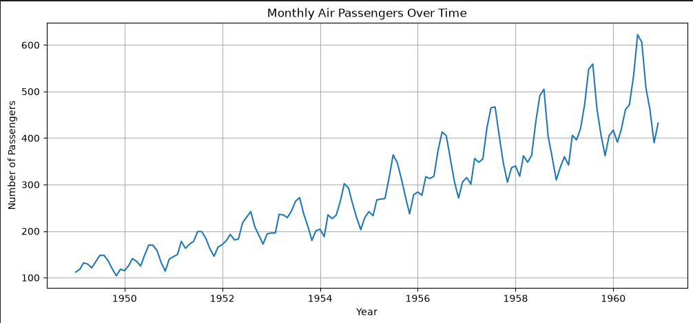
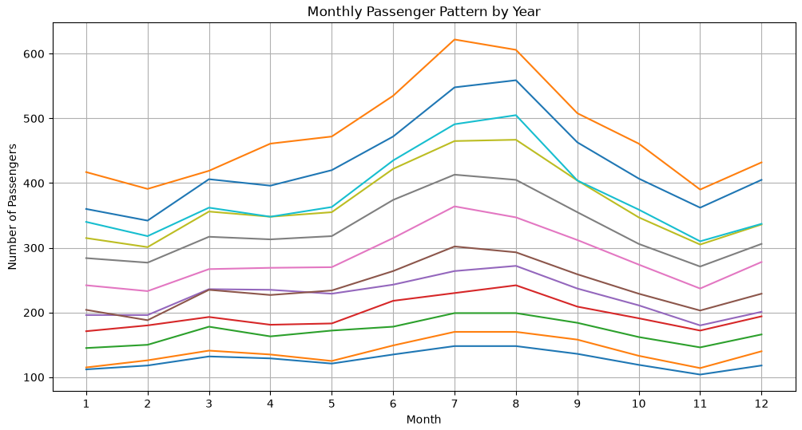
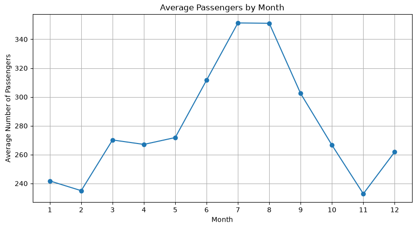
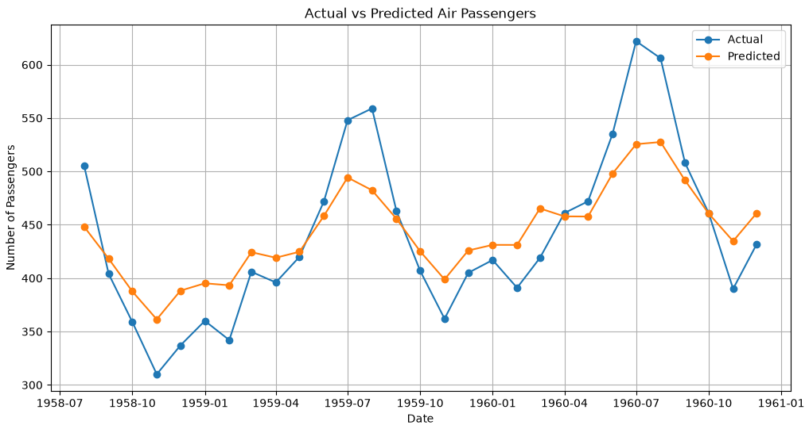
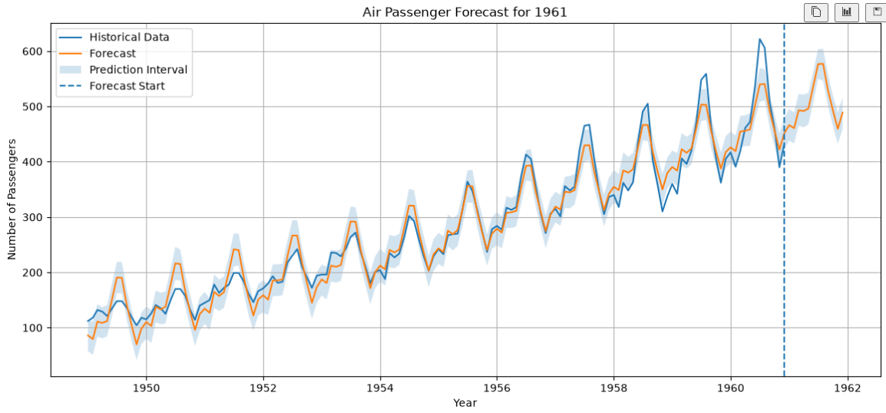
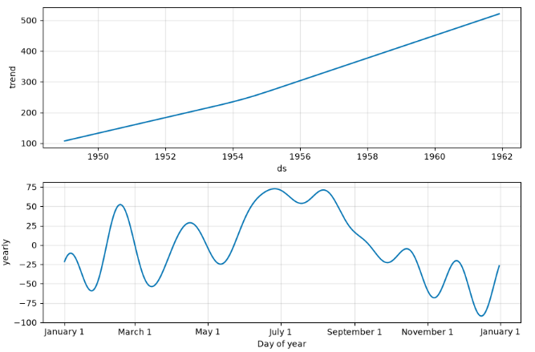

# Predictive Analytics Using Historical Data

## 📌 Project Overview

This project focuses on **predictive analytics using historical time-series data**. The objective is to analyze historical air passenger data, identify long-term trends and seasonal patterns, evaluate a forecasting model, and predict future passenger demand.

The **AirPassengers dataset** contains monthly passenger observations from **1949 to 1960**.

A **Prophet time-series forecasting model** was used to forecast future passenger numbers.

---

## 🎯 Objectives

- Analyze historical passenger data.
- Clean and preprocess the dataset.
- Identify trends and seasonal patterns.
- Build a time-series forecasting model.
- Evaluate model performance using MAE, MSE, and RMSE.
- Forecast passenger demand for the next 12 months.
- Visualize historical data, predictions, trends, and seasonality.

---

## 📊 Dataset

**Dataset:** AirPassengers

The dataset contains:

- **144 monthly observations**
- Time period: **January 1949 – December 1960**
- `Month` — observation month
- `#Passengers` — number of passengers

During preprocessing, the columns were converted to the format required by Prophet:

- `ds` → date/time
- `y` → passenger count

---

## 🛠️ Technologies Used

- Python
- Pandas
- NumPy
- Matplotlib
- Prophet
- Scikit-learn
- Jupyter Notebook
- VS Code

---

## 🔄 Project Workflow

1. Project setup
2. Dataset collection
3. Data loading and inspection
4. Data cleaning and preprocessing
5. Exploratory Data Analysis
6. Trend and seasonality analysis
7. Chronological 80/20 train-test split
8. Prophet model training
9. Test-period prediction
10. Model evaluation
11. Actual vs predicted visualization
12. Final model training using the complete dataset
13. 12-month future forecasting
14. Trend and seasonality component analysis

---

## 📈 Exploratory Data Analysis

The historical data revealed:

- A strong **upward long-term trend** in passenger numbers.
- A clear **yearly seasonal pattern**.
- Passenger demand generally reaches higher levels around **July and August**.
- Seasonal fluctuations become larger as the overall passenger count increases.

---

## 🤖 Model

### Prophet Forecasting Model

Prophet was selected as the time-series forecasting model because the dataset contains:

- A clear time-based structure
- Strong long-term trend
- Repeating yearly seasonality

The model was initially trained using **80% of the historical data** and evaluated on the remaining **20%**.

### Train-Test Split

| Dataset  | Observations |
| -------- | -----------: |
| Training |          115 |
| Testing  |           29 |
| Total    |          144 |

The split was chronological to ensure that future observations were not used to train the model.

---

## 📏 Model Evaluation

The model was evaluated on the unseen test period using three metrics:

| Metric |      Result |
| ------ | ----------: |
| MAE    |   **33.90** |
| MSE    | **1708.55** |
| RMSE   |   **41.33** |

### Interpretation

The **MAE of 33.90** means that the model's predictions were, on average, approximately 34 passengers away from the actual passenger count during the test period.

The RMSE of **41.33** indicates the typical prediction error while giving greater weight to larger errors.

---

## 🔮 Future Forecast

After evaluation, the Prophet model was retrained using the complete **144-month historical dataset**.

The final model was then used to forecast the next **12 months**:

**January 1961 – December 1961**

### Selected Forecast Results

| Month          | Predicted Passengers |
| -------------- | -------------------: |
| January 1961   |               466.20 |
| February 1961  |               460.66 |
| March 1961     |               493.07 |
| April 1961     |               491.71 |
| May 1961       |               496.00 |
| June 1961      |               537.11 |
| July 1961      |               576.68 |
| August 1961    |               577.10 |
| September 1961 |               528.53 |
| October 1961   |               493.38 |
| November 1961  |               459.53 |
| December 1961  |               488.92 |

The model predicts the highest passenger levels around **July–August 1961**.

---

## 📉 Forecast Components

The Prophet model identified two major components:

### Trend

The trend component shows a strong long-term increase in passenger demand throughout the historical period.

### Yearly Seasonality

The yearly component shows a repeating seasonal pattern, with positive seasonal effects around the middle of the year and lower seasonal effects during several later months.

---

## 📁 Project Structure

```text
Predictive-Analytics-AirPassenger/
│
├── data/
│   └── AirPassengers.csv
│
├── notebooks/
│   └── Predictive_Analytics_AirPassengers.ipynb
│
├── images/
│   └── [Project screenshots/visualizations]
│
├── README.md
│
└── .gitignore
```

---

## 📊 Project Visualizations

### Historical Passenger Trend



### Yearly Passenger Pattern



### Average Passengers by Month



### Actual vs Predicted



### 1961 Future Forecast



### Prophet Trend and Seasonality Components



## ✅ Conclusion

The project demonstrates how historical time-series data can be used for predictive analytics and future forecasting.

The Prophet model successfully captured the **long-term growth trend** and **yearly seasonal pattern** in the AirPassengers dataset. After evaluating the model on unseen historical data, the final model was trained using all available observations and used to generate a 12-month future forecast.

This project demonstrates practical skills in **data preprocessing, exploratory data analysis, time-series modeling, model evaluation, visualization, and forecasting**.
